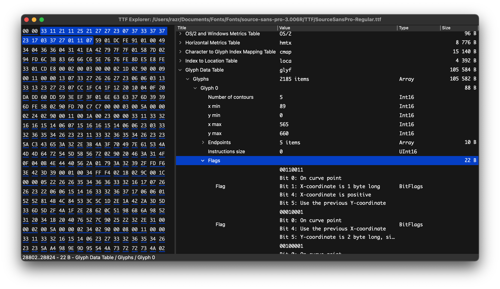

# ttf-explorer

A simple tool to explore a TrueType font content as a tree.
With a final goal to define each byte in a font.



## Build & Run

`ttf-explorer` depends on [Qt](https://www.qt.io/download-qt-installer)
and [Rust](https://www.rust-lang.org/tools/install),
so you have to install them first.

You also need a C++ compiler with C++17 support.

And then:

```sh
# On Linux (assuming you have Qt and pkg-config installed)
cargo build --release

# On Windows/macOS
QT_DIR=/path/to/qt cargo build --release
```

## Supported tables

avar,
bdat,
bloc,
CBDT,
CBLC,
CFF,
CFF2,
cmap,
cvt,
EBDT,
EBLC,
fpgm,
fvar,
GDEF (mostly),
glyf,
gvar,
head,
hhea,
hmtx,
HVAR,
kern,
loca,
maxp,
MVAR,
name,
OS/2,
post,
sbix,
STAT (partially),
SVG,
vhea,
vmtx,
VORG,
VVAR

## License

MIT

Also, most of the value names were taken from the Microsoft's
[OpenType™](https://docs.microsoft.com/en-us/typography/opentype/spec/) specification.
